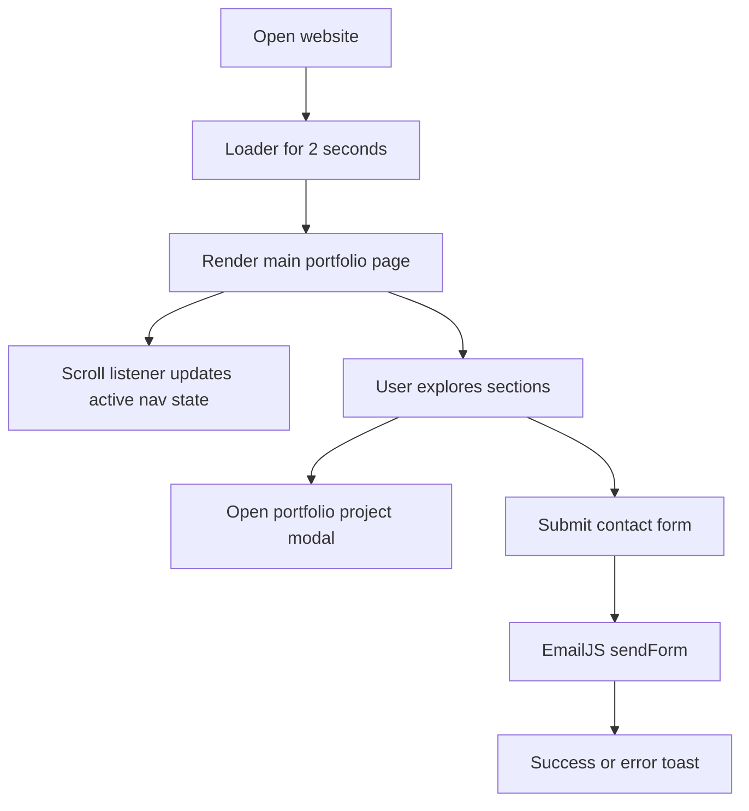
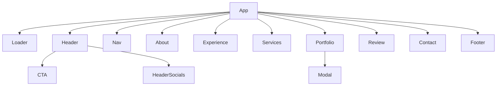
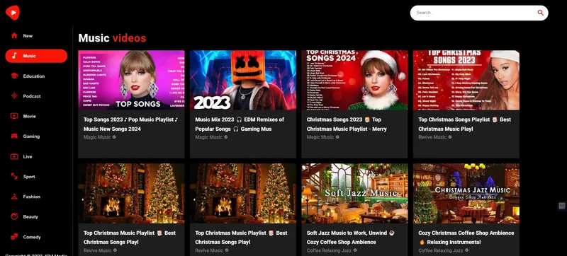
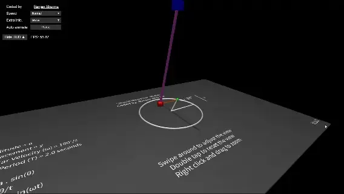
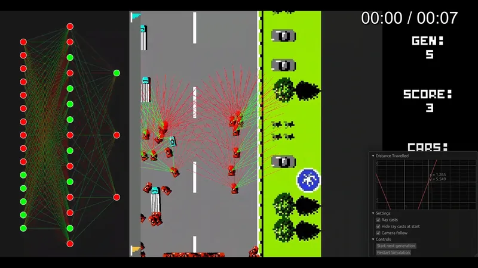
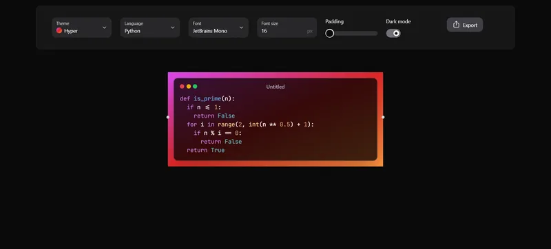
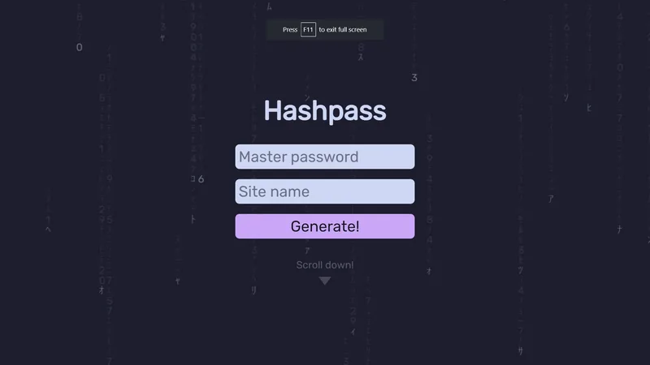
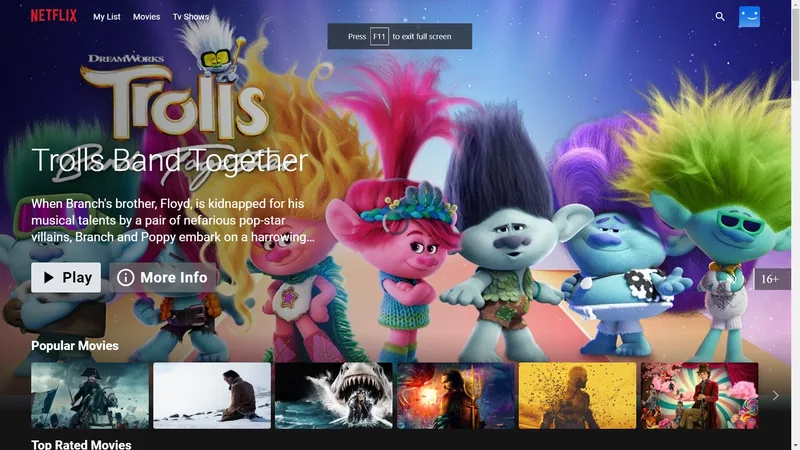

# Portfolio Website

Hi, I am Ranjan Sharma. This repository contains the source code for my personal portfolio website.

Live site: [ranjansharma.info.np](https://ranjansharma.info.np)

## What this site includes

- Intro header with social links and call to action
- About section with rotating tech cube
- Experience and services sections
- Portfolio projects with modal details
- Review carousel with Swiper
- Contact form powered by EmailJS and toast notifications
- Footer with quick links

## Built with

- React 18
- SCSS and CSS modules by component
- AOS for scroll animations
- Swiper for reviews
- React Icons and Font Awesome
- EmailJS for contact messages

## App flowchart



## Component diagram



## Visuals from the live website

### Portfolio cards

| YouTube Clone | SHM Visualization |
| --- | --- |
|  |  |

| Rust AI Car Driving | Visualize Code |
| --- | --- |
|  |  |

| HashPass | Netflix Clone |
| --- | --- |
|  |  |

## Local setup

```bash
npm ci
npm start
```

## Production build

```bash
npm run build
```

Thanks for checking out my portfolio.
